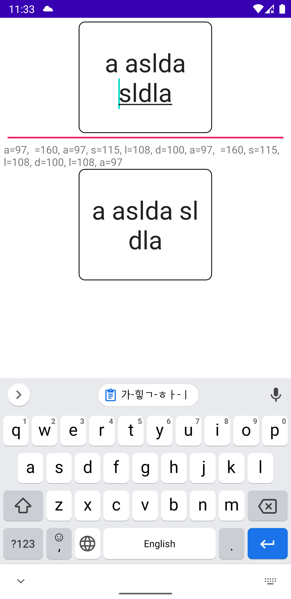

### Preview

정규식으로 nbsp와 word joiner 조합으로 해본 character wrap 
- 위쪽 Edit는 기본 버전 / 아래쪽은 정규식 처리 버전 
- 길이나 selection 보정은 안함
- 삭제시 word joiner제거되면 바로앞 문자도 제거하는 로직 넣음

| 샘플 | 샘플 |
| :----------------------------: | :----------------------------: |
| 문자열 사이에 느낌표가 존재  | 느낌표로 문자열이 시작  |
| 문자열 사이에 공백 존재  |  |

※ 한글같은 완성형 언어는 정규식만 추가하면 될 것 같음 
